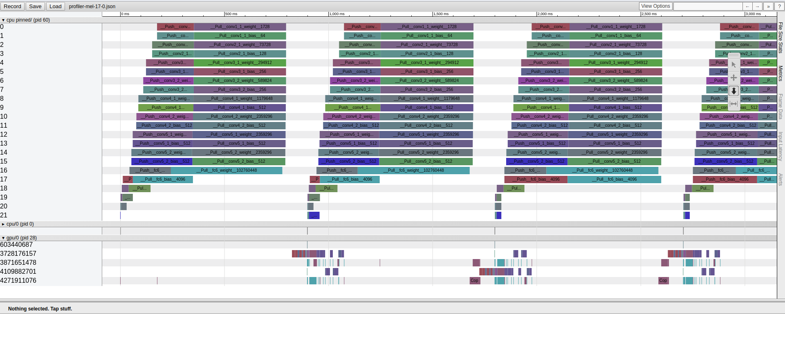

# MXNet Network Profiler (*nwprof*)

*nwprof* profiles the communication delay of each individual layers in the neural network during distributed training. This is an extention of the standard MXNet profiler.

## Applying the patch
1. Clone MXNet and switch the branch to v1.1.0.
```
git clone --recursive https://github.com/apache/incubator-mxnet.git --branch v1.1.0
cd incubator-mxnet
git checkout -b nwprof
```
2. Download and apply the patch using following command.
```
git am < nwprof.patch
```
3. Build the codebase. Enable USE_PROFILER and USE_DIST_KVSTORE as well. (refer http://mxnet.incubator.apache.org/install/ubuntu_setup.html#build-mxnet-from-source)

## Using nwprof
The patch include 2 commits, one with the changes needed in the MXNet codebase and second an sample profiling code for image-classification examples. Following command trains ResNet-110 on CIFAR-10 dataset with emulated data parallel training of one worker process and one KVServer running on single machine.
```
cd example/image-classification
python ../../tools/launch.py -n 1 --launcher local python train_cifar10.py --network resnet --num-layers 110 --batch-size 128 --gpus 0 --kv-store dist_device_sync
```
The code is set to profile all the iterations between 100 and 110 of first epoch. The profiled content is stored at the home directory with filename in the format ~/profiler-<machine_name>-<machine_index>.json.

Visualize the profiler file using chrome://tracing/

## Naming convention
*nwprof* uses the following naming convention to describe communication of each layer in the neural network.

  `__<Push/Pull>__<Layer Name>__<Number of Parameters>`
  
Following is a screenshot of the profiled data. The communication delay of each layer is shown at the top under CPU Pinned section. The layers are indexed according to its position in the neural network starting from 0 for the first layer.
  

